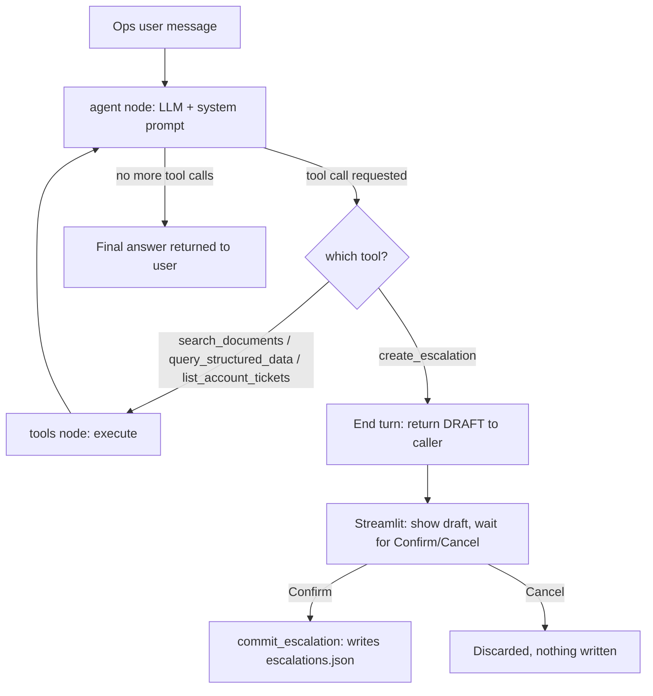

# Architecture Note

## Agent design

Built on **LangGraph** as a simple two-node graph: `agent` (calls the LLM,
bound to the 4 tools) and `tools` (executes whichever tools the model called),
looping until the model responds without further tool calls. A `MemorySaver`
checkpointer keeps conversation state per thread so multi-turn context
(e.g. "confirm that escalation") works naturally.

The system prompt (in `agent.py`) does three jobs explicitly rather than
leaving them implicit:
1. States the source-authority order (agreement > SOP > policy > product
   guide > deprecated/tickets) as a hard rule, not a suggestion.
2. States the escalation criteria (no confident source, conflicting sources,
   exception beyond stated limits, P1 severity) so escalation is a judgment
   call grounded in the documents, not a keyword trigger.
3. States that `create_escalation` only drafts — never claim something was
   created until the tool/UI layer confirms it.

**Confirmation gating** is enforced structurally, not just via prompt
instruction: `should_continue` in the graph checks if the pending tool call
is `create_escalation` and, if so, ends the graph turn immediately — returning
the draft to the caller — instead of routing to the `tools` node that would
execute it. The Streamlit layer then requires an explicit button click before
calling `tools_module.commit_escalation()`, which is the only function that
actually writes the escalation record.

## Tool design

Three required tools, plus one convenience tool:

| Tool | Purpose | Notes |
|---|---|---|
| `search_documents` | Vector search over the 6 source PDFs | Returns authority_level + status metadata alongside every chunk, so the model can see precedence, not just content |
| `query_structured_data` | Look up a single account/order/ticket by ID | Scoped by `UserContext` inside `db.py` |
| `list_account_tickets` | Full ticket history for an account | Needed for multi-step questions like "has this happened before for this customer" |
| `create_escalation` | Drafts a state-changing action | Never writes; see confirmation gating above |

## Document and structured-data handling

- **Documents**: PDFs are split on numbered-heading boundaries (`"\n1. Heading"`
  style) rather than fixed character windows, so a clause like the LumenWorks
  failed-pickup credit rule stays intact as one chunk instead of being split
  mid-sentence. Each chunk is tagged with `doc_type`, `authority_level`,
  `status` (current/deprecated), and `account_id` (for agreement docs) at
  ingestion time — this metadata is what the agent reasons over, not just
  semantic similarity.
- **Structured data**: the xlsx (`accounts`, `orders`, `tickets`) is loaded
  into SQLite once at setup. Every read goes through a function that takes an
  explicit `UserContext` and raises `PermissionError` on out-of-scope access —
  this is enforced in `db.py`, independent of what the LLM decides to do, per
  the assessment's explicit requirement that access control live in the
  data/tool layer.
- The workbook's snapshot time is extracted from the README sheet and injected
  into the system prompt as "now" for the model, and used directly by
  `proactive.py`'s scoring — so all elapsed-time reasoning (30-minute
  cancellation window, 4-hour pickup delay, SLA proximity) is anchored to the
  dataset's stated reference time rather than the real clock.

## Source reliability and conflict handling

Encoded as a 5-level `authority_level` on every document chunk (1 = signed
customer agreement, highest, through 5 = deprecated policy, never used to
answer). The system prompt requires the model to state which source it used
and why it takes precedence whenever an agreement overrides a default —
this was deliberately tested against the supplied data pack, e.g.:
- Northstar's agreement waives cancellation fees entirely (overriding the
  SOP's 30-minute/₹250 rule) — but only pre-pickup; post-pickup reverts to
  the standard return-to-origin process.
- LumenWorks' agreement replaces the SOP's default credit calculation with a
  fixed ₹300 amount for its specific failed-pickup threshold.
- Two historical ticket resolutions (`TKT-450`, `TKT-451`) in the data
  contain guidance that contradicts current documented policy — the prompt
  explicitly instructs the model to treat `historical_resolution` fields as
  context only and defer to current sources when they conflict, rather than
  repeating the old (wrong) answer.

## Major trade-offs

- **TF-IDF embeddings instead of a hosted embedding model.** The sandboxed
  build environment couldn't reach the model-download host needed for a local
  sentence-transformer, and I didn't want to hard-depend on a second API key
  beyond Anthropic's. To offset TF-IDF's exact-vocabulary-match weakness, I
  added a small domain query-expansion map (`QUERY_SYNONYMS` in `ingest.py`,
  e.g. "charge"→"fee", "late"→"delay past window") so paraphrased questions
  still retrieve the right clause. `ingest.py`'s `TfidfEmbeddingFunction` is
  built as a drop-in replaceable `chromadb.EmbeddingFunction`, so swapping in
  OpenAI/Voyage embeddings for a larger production corpus is a small change.
- **Single internal role (`ops`)** rather than a full customer-facing +
  internal dual system, to spend the available time on the reasoning/conflict
  logic instead of parallel auth flows. See Product Note for what a
  customer-facing extension would need.
- **No streaming responses** in the UI — turns are request/response. Adding
  streaming is straightforward with LangGraph's `.stream()` but wasn't
  prioritized given the time budget.
- **Escalation store is a local JSON file**, standing in for a real
  ticketing-system API call, per the assessment's explicit allowance to mock
  this.

## Confidence scoring (added after initial build)

`assess_confidence()` in `ingest.py` gives every `search_documents` call an
explicit high/medium/low signal, returned alongside the retrieved chunks and
surfaced to the model in the system prompt's instructions. It catches two
specific failure patterns rather than being a generic score:
1. **Nothing relevant retrieved** (top relevance below threshold) → low.
2. **A higher-authority source is present but not the top text match** —
   e.g. a query about "Northstar P1 response time" TF-IDF-matches the
   general Policy v3 document better than Northstar's own agreement, purely
   on word overlap, even though the agreement should win. This was an actual
   bug caught while testing: the naive "check if top-2 scores are close"
   heuristic missed it, because the agreement chunk ranked #2 with a real
   gap in score. Fixed by explicitly scanning all returned results for any
   higher-authority-level source, not just comparing the top two by score.

## Automated tests

`backend/test_suite.py` (pytest, 16 tests, no API key required) covers:
- Access control: ops vs. customer-scoped reads, cross-account denial,
  denial surfaced as a tool-readable error rather than a crash.
- Retrieval: Northstar's agreement is retrievable, deprecated policy is
  correctly tagged authority level 5, confidence scoring behaves correctly
  on the higher-authority-elsewhere case, on no-match, and on empty input.
- Escalation: `create_escalation` only ever returns a draft; `commit_escalation`
  is the sole path that marks something `CREATED` and persists it.
- Proactive triage: P1 tickets outrank P3 tickets, all open tickets are
  included, scores are sorted correctly.

This doesn't cover the LLM's own reasoning quality (that needs a live API
key and is inherently harder to unit-test), but it locks down every
deterministic piece the agent depends on — so a prompt-tuning session can't
silently break access control or retrieval tagging without a test failing.

## Audit trail (domain-informed addition)

CalQuity's stated market is financial institutions — a segment where "the
agent gave a good answer" is necessary but not sufficient; a compliance
reviewer or an unhappy customer will eventually ask "show me why the system
said that, and who signed off on the action it took." `audit.py` logs an
append-only JSONL record per turn: which tools fired, which document sources
were cited (with authority level), the confidence assessment, and the full
lifecycle of any escalation (drafted → confirmed-by-whom → committed) rather
than just the final chat text. The Streamlit "Audit Log" tab surfaces this
for review, including a check for escalations that were drafted but never
confirmed or cancelled — a real failure mode (someone closes the tab mid-flow)
that would otherwise leave a flagged issue silently unresolved.

This was deliberately built as flat JSONL, not a database — it's the shape
structured logs take right before being shipped to a real log pipeline
(CloudWatch/Datadog/etc.), so the production migration is "point a log
shipper at this file," not a rewrite.

## Numeric trust guard (deterministic, non-LLM)

`trust_guard.py` runs a regex-based check after every answer: extract any
₹/INR figures the agent stated, extract figures present in the text of
whatever sources were actually cited that turn, and flag any answer-figure
that doesn't appear in a cited source. This is the cheapest, most
deterministic defense against the single most damaging failure mode in a
financial-support tool — a confidently wrong number — and it costs no extra
LLM call. It's a floor, not a ceiling: it can't confirm a number is
*correct*, only that it's *traceable*. Wired into `run_turn()` and surfaced
as a visible warning in the Streamlit chat UI, not buried in a log.
