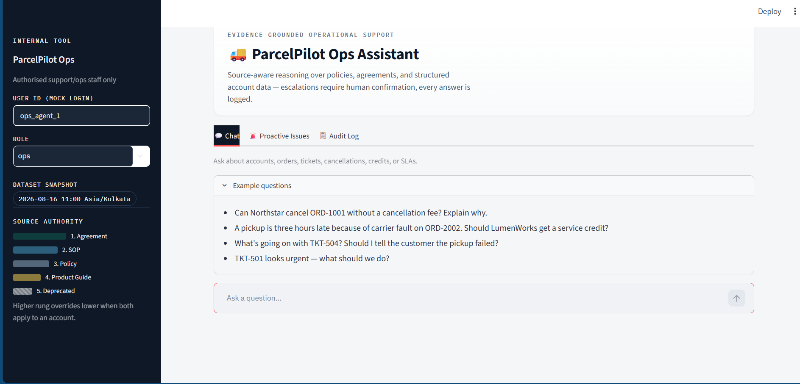
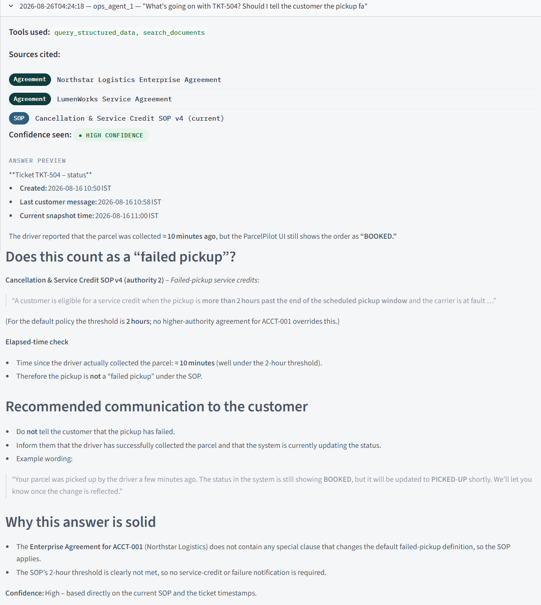
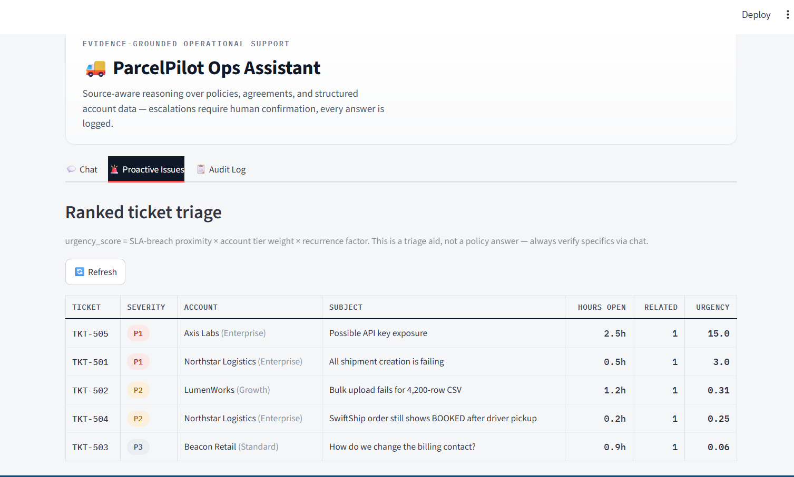
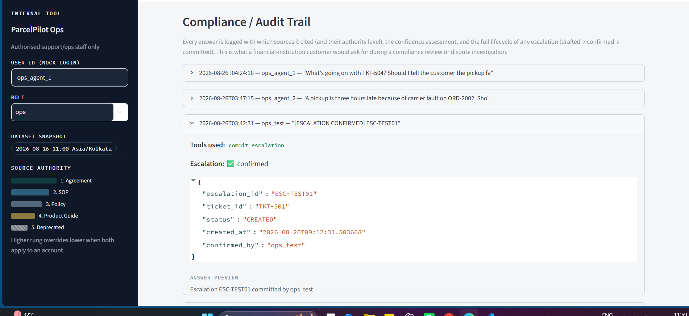
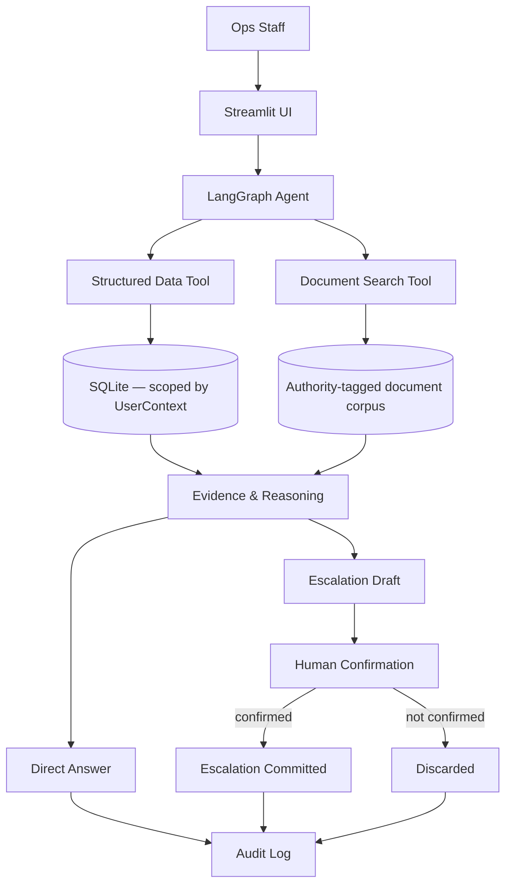

# 🚚 ParcelPilot
### Internal Ops Support Assistant

<p align="center">
  <strong>AI-powered internal operations support with grounded retrieval, access control, auditability, and proactive ticket triage.</strong>
</p>


> Evidence-grounded AI support for operational decisions — source-aware reasoning,
> deterministic guardrails, escalation gating, and auditable answers, built for
> ParcelPilot's internal support/operations staff.


---

## 🔗 Demo & Submission

- **Live Demo:** [Add hosted application URL]
- **Demo Video:** [xyz]
- **Architecture:** [`ARCHITECTURE.md`](ARCHITECTURE.md)
- **Product Note:** [`PRODUCT_NOTE.md`](PRODUCT_NOTE.md)
- **Evaluation:** [`EVAL.md`](EVAL.md)

---

## ✨ What It Does

ParcelPilot gives internal operations teams a single interface to investigate and reason about:

- 👤 Customer accounts and access permissions
- 📦 Orders, cancellations, pickup windows, and service credits
- 🎫 Support tickets and urgency
- 📚 Policies, SOPs, and customer-specific agreements
- ⚖️ Conflicting sources and authority precedence
- 🚨 Escalations requiring human confirmation
- 📋 Audit history and compliance review
- 🔎 Proactive ticket prioritization

---

##  How It Works
```
User Question
      │
      ▼
LangGraph Agent
      │
 ┌────┴─────┐
 ▼          ▼
Structured  Document
Data        Retrieval
 │          │
 └────┬─────┘
      ▼
Grounded Reasoning
      │
 ┌────┴─────┐
 ▼          ▼
Answer    Escalation
             │
        Human Confirmation
             │
           Commit
             │
             ▼
         Audit Log
```

--- 

## At a Glance

| | |
|---|---|
| **What it is** | An internal (staff-facing) AI assistant that answers operational support questions by reasoning over policies, SOPs, customer agreements, and structured account/order/ticket data |
| **Who it's for** | Authorised ParcelPilot support/operations staff — not directly customer-facing |
| **Core capability** | Source-aware reasoning: knows that a customer agreement can override a default policy, that a deprecated document is never authoritative, and that a historical ticket resolution may simply be wrong |
| **Key safety property** | State-changing actions (escalations) are drafted, never silently executed — a human must explicitly confirm |
| **Key trust property** | Every answer is logged with its sources, confidence, and outcome; numeric claims are checked against retrieved evidence |

---

## Tech Stack

| Layer | Technology | Role |
|---|---|---|
| **UI** | Streamlit | Staff-facing Chat, Proactive Issues, and Audit Log interface |
| **Agent orchestration** | LangGraph | Stateful tool routing and the human-in-the-loop escalation gate |
| **LLM layer** | Anthropic via LangChain | Natural-language reasoning over retrieved evidence and structured results |
| **Document retrieval** | scikit-learn TF-IDF | Lightweight, deterministic retrieval over the authority-tagged document corpus |
| **Structured data** | SQLite | Scoped access to account, order, and ticket data |
| **Application layer** | Python 3.11+ | Agent tools, business logic, proactive triage, audit logging, and guardrails |
| **Testing** | pytest | Deterministic tests for access control, retrieval, escalation, audit, trust checks, and triage |
| **Evaluation** | Hand-verified golden set (`EVAL.md`) | End-to-end validation of actual assistant responses |

---

## 🧠 Agent Architecture & AI Tooling

ParcelPilot uses a **tool-augmented, policy-grounded agent architecture** rather than allowing the LLM to answer directly from its own knowledge.

The model is responsible for **interpreting the request, selecting the appropriate tools, reconciling retrieved evidence, and producing the final explanation**. Deterministic application logic remains responsible for authorization, structured-data access, escalation state changes, retrieval metadata, and auditability.

### Agent orchestration

The agent is implemented as a **LangGraph-based tool-calling workflow**:

```text
User Query
    │
    ▼
┌──────────────────────┐
│   Agent / LLM Node   │
│ Intent + tool choice │
└──────────┬───────────┘
           │
     ┌─────┴───────────────────────────┐
     │                                 │
     ▼                                 ▼
Structured Data                  Document Retrieval
(query account/order/             (policies, SOPs,
ticket information)              customer agreements)
     │                                 │
     └──────────────┬──────────────────┘
                    ▼
          Evidence + Authority
             Reconciliation
                    │
                    ▼
          ┌───────────────────┐
          │ Grounded Response │
          │ + confidence      │
          └─────────┬─────────┘
                    │
                    ▼
          Escalation if required
          (draft → confirmation
              → commit)
                    │
                    ▼
              Audit Logging
```

### 🛠️ Agent tools

The agent has a deliberately small tool surface. Each tool has a clearly bounded responsibility:

| Tool | Purpose | Why it is deterministic |
|---|---|---|
| `query_structured_data` | Retrieves accounts, orders and tickets | Access-controlled database queries |
| `search_documents` | Retrieves relevant policies, SOPs and customer agreements | Returns authority/status/relevance metadata with evidence |
| `create_escalation` | Creates a proposed operational escalation | Produces a **draft only**; does not mutate state |
| `commit_escalation` | Commits a previously confirmed escalation | Explicit confirmation gate before state change |

This separation keeps the LLM in the **reasoning/orchestration layer**, while sensitive operations remain behind deterministic application boundaries.

### 🤖 How AI is used

The LLM is used for tasks where language reasoning adds value:

- Interpreting natural-language operations questions
- Deciding which tools are needed
- Synthesizing structured records with policy evidence
- Resolving conflicts using document authority and applicability
- Explaining the reasoning behind an answer
- Deciding when a situation should be escalated

The LLM is **not treated as the source of truth** for:

- Account, order, or ticket data
- Authorization decisions
- Policy text
- Escalation persistence
- Audit records
- Numerical evidence retrieved from the system

This distinction is intentional:

> **The model reasons over evidence; it does not manufacture the evidence.**

### 🔐 Grounding, authority & trust controls

Retrieved documents carry metadata such as:

- Authority level
- Current/deprecated status
- Account applicability
- Retrieval relevance

When multiple sources apply, the agent prioritizes the **highest-authority applicable source** rather than simply trusting the first retrieved document.

A separate grounding check validates material currency figures in the final response against retrieved evidence. Unsupported figures are surfaced as **unverified** rather than silently presented as facts.

### 🔄 Model fallback

The model layer is isolated behind a small callable interface so the application can recover from provider/API failures.

The configured primary model is attempted first. **Rate-limit/quota failures can fall back to the secondary model**, while unrelated failures are surfaced rather than silently hidden.

This keeps provider-specific logic out of the business and retrieval layers and makes the model configuration replaceable without changing the agent's core architecture.

---

## Why This Project Is Interesting

Most support chatbots treat every document as equally trustworthy and every retrieved chunk as equally relevant. That assumption breaks immediately in a real operations environment: a signed customer agreement can override a standard policy, a policy can be superseded by a newer version, and a past support ticket's resolution can simply have been wrong.

This project is built around that reality rather than around it. The interesting engineering problem here isn't "can it retrieve a relevant document" — it's **"does it retrieve the right document to defer to, and does it say so explicitly when it isn't sure."**

---

## The Problem

ParcelPilot's operations team fields questions like:

- *Can this specific customer cancel this specific order without a fee?*
- *Does a late pickup entitle this account to a service credit, and how much?*
- *Is this ticket a known, already-diagnosed issue, or something new?*
- *Does this need to be escalated, or can it be answered directly?*

Answering these correctly requires combining a customer's specific contract terms, the current SOP, current policy, product/known-issue context, and structured order/ticket data — while explicitly discounting sources that are outdated or unreliable (a deprecated policy, a historical ticket resolution that contradicts current guidance).

---

## What the Assistant Can Do

- Answers natural-language operational questions using only the supplied source pack (policies, SOPs, agreements, product docs, and structured account/order/ticket data)
- Applies a defined source-authority hierarchy when sources conflict, rather than trusting whichever chunk retrieves highest
- Performs multi-step reasoning across structured lookups and document search in a single turn (e.g., look up an order → identify the account → check its agreement → apply the relevant SOP → decide if escalation is warranted)
- Drafts — but never silently commits — escalations, ticket updates, or other state-changing actions
- Surfaces a confidence signal on every document-search result, flagging when a higher-authority source is relevant but wasn't the top text match
- Runs a deterministic grounding check on any currency figure it states, flagging anything not traceable to a cited source
- Logs every turn to an auditable, append-only trail
- Provides a proactive, ranked view of tickets that deserve attention — not just reactive Q&A

---

## Product Walkthrough

The Streamlit interface is designed as an internal operations workspace rather than a generic chatbot. It exposes the assistant's reasoning, source authority, proactive triage, and audit trail directly in the workflow.

### 1. Operational Chat

The main workspace lets authorised operations staff ask questions about accounts, orders, tickets, cancellations, service credits, and SLAs. The sidebar exposes the dataset snapshot and source-authority hierarchy.

<p align="center">
  
</p>

### 2. Evidence-Grounded Answer

The TKT-504 example shows the complete reasoning chain, including the failed-pickup determination, recommended customer communication, supporting evidence, and confidence assessment.

<p align="center">
  
</p>

### 3. Proactive Issue Triage

The Proactive Issues view ranks open tickets using severity, SLA proximity, and recurrence-related signals so the team can identify issues that deserve attention before someone asks about them.

### 4. Compliance / Audit Trail

Every completed interaction is recorded with the tools used, sources consulted, confidence assessment, and escalation lifecycle, providing a traceable view of how an answer was produced and whether a state-changing action was confirmed.

<table>
<tr>
<td width="50%" valign="top" align="center">

<strong>Proactive Issue Triage</strong>



</td>
<td width="50%" valign="top" align="center">

<strong>Compliance / Audit Trail</strong>



</td>
</tr>
</table>

---

## Architecture Overview



**Backend**

| Module | Responsibility |
|---|---|
| `backend/db.py` | SQLite loading and scoped query functions. Every read takes an explicit `UserContext` and enforces access control at the query layer — not left to the LLM to decide what it should or shouldn't look at. |
| `backend/ingest.py` | Document ingestion: chunking, authority tagging, and vector-store preparation. Uses local TF-IDF (scikit-learn) embeddings — deliberate, given a small, fixed source corpus (see [Design Decisions](#design-decisions--trade-offs)). |
| `backend/tools.py` | The agent's operational tools — document search, structured-data lookup, and escalation drafting. Also participates in access-control enforcement. |
| `backend/agent.py` | LangGraph agent graph: system prompt, source-authority hierarchy, tool orchestration, and the escalation confirmation gate. |
| `backend/proactive.py` | Ranks open tickets for proactive triage (severity, recurrence, and related signals). |
| `backend/audit.py` | Append-only audit logging of every completed turn. |

**Frontend**

| Tab | Purpose |
|---|---|
| 💬 Chat | Ask operational questions, see which tool the agent used, confirm or cancel any drafted escalation |
| 🚨 Proactive Issues | Ranked view of open tickets needing attention |
| 📋 Audit Log | Review what was answered, on what evidence, at what confidence, and what actions were taken |

---

## Source Authority: Retrieval Rank ≠ Policy Authority

This is the central architectural idea in the project: **what a search ranks highest is not the same as what governs the answer.** A general policy document can score a strong text match against a query while a customer's specific signed agreement — which actually overrides that policy for this account — scores lower purely on word overlap. The system is built to catch that gap explicitly rather than defer to whatever ranked first.

| Priority | Source | Role |
|---|---|---|
| 1 (highest) | Customer-specific signed agreement | Account-specific override |
| 2 | Current Cancellation & Service Credit SOP | Operational default |
| 3 | Current Support Policy | General policy default |
| 4 | Product Operations Guide / Known Issues | Product/operational facts, not policy |
| 5 (lowest) | Deprecated Support Policy | Never authoritative — retained for reference only |

Historical ticket resolutions are treated as **context only**. They are never allowed to override current documented policy, and the system is designed to flag rather than repeat a historical answer that contradicts current sources.

> **Design principle:** a lower-ranked or differently-retrieved document must never silently override a higher-authority source that applies to the account in question.

---

## Escalation Lifecycle: Deliberately Two-Phase

The agent can identify when a question needs human judgment — an unsupported exception, conflicting sources, or an issue matching a critical-severity definition — but it cannot act on that alone.

```
Agent determines escalation is warranted
                 │
                 ▼
        create_escalation (tool call)
                 │
                 ▼
         DRAFT ONLY — not committed
                 │
                 ▼
         Human reviews the draft
                 │
                 ▼
         Explicit confirmation
                 │
          ┌──────┴──────┐
          ▼             ▼
      Committed      Discarded
```

The LangGraph agent structurally pauses before executing `create_escalation` and returns the draft to the caller instead of routing to tool execution — this isn't just a prompt instruction, it's a branch in the graph itself. The model cannot silently perform a state-changing action; a human confirmation step is required before anything is written.

---

## Reliability & Safety Mechanisms

| Risk | Design response |
|---|---|
| Conflicting policy sources | Explicit source-authority hierarchy (see above) |
| Retrieval rank misleading authority | Confidence check flags when a higher-authority source exists but wasn't the top match |
| Historical ticket contains wrong guidance | Historical resolutions treated as context only, never authoritative |
| Unsupported/invented financial figure | Deterministic numeric grounding check against cited source text |
| Dangerous state change | Human confirmation gate before any escalation is committed |
| Access-control bypass via prompt manipulation | Enforcement lives in the DB/tool layer, not the prompt |
| Time ambiguity | Fixed dataset snapshot time used for all elapsed-time reasoning, not real-world "now" |
| Transient LLM API failures | Retry handling for rate limits and connection errors |

> **On access control specifically:** prompts are not the security boundary here. Every structured-data read takes an explicit `UserContext` and is scoped/denied at the query layer in `db.py` — a prompt injection or a persuasive user message cannot expand what the underlying query is allowed to return.

---

## Auditability

Every completed turn is written to an append-only audit log (`backend/audit.py`), recording:

- timestamp, user ID, and role
- the query asked
- which tools were used
- which sources were consulted and their authority level
- the confidence assessment
- any escalation drafted, and whether it was confirmed
- a preview of the final answer

This is intentionally a **lightweight, assessment-scoped auditability design** — not a claim of full enterprise compliance tooling. The goal it serves: for any given answer, a reviewer should be able to reconstruct *what the agent answered, what evidence it used, how confident it was, and whether any state-changing action was actually confirmed.* That question matters more in an operations tool serving financial-institution customers than in a generic support bot, which is why it was built in rather than left as a "nice to have."

The Streamlit **Audit Log** tab exposes this directly, including a check for escalations that were drafted but never confirmed or cancelled.

---

## Proactive Issue Triage

Rather than only answering when asked, `backend/proactive.py` produces a ranked view of open tickets that deserve attention — factoring in severity, how close a ticket is to breaching its response target, and recurrence signals suggesting multiple customers may be hitting the same underlying issue. Exposed via the **Proactive Issues** tab.

---

## Project Structure

```text
backend/
├── db.py            # SQLite loader + scoped query functions (access control lives here)
├── ingest.py         # PDF -> chunked, authority-tagged document corpus
├── tools.py           # agent tools: document search, structured lookup, escalation drafting
├── agent.py            # LangGraph agent graph, system prompt, confirmation gating
├── proactive.py          # ranked ticket triage
├── audit.py                # append-only audit logging
├── test_suite.py             # automated tests (no API key required)
└── data/                       # supplied source PDFs + xlsx

frontend/
└── app.py    # Streamlit UI — Chat / Proactive Issues / Audit Log

ARCHITECTURE.md    # design reasoning, trade-offs, what was left out
PRODUCT_NOTE.md    # product framing, priorities, one success metric
EVAL.md            # hand-verified golden test set
README.md
```

---

## Setup

### macOS / Linux

```bash
cd backend
python3 -m venv venv && source venv/bin/activate
pip install -r requirements.txt
```

### Windows (PowerShell)

```powershell
cd backend
python -m venv venv
venv\Scripts\Activate.ps1
pip install -r requirements.txt
```

### Configuration

Create a `.env` file inside `backend/` (never commit this — it's already git-ignored):

```
ANTHROPIC_API_KEY=sk-ant-your-key-here
```

> Swap for the appropriate key/provider if you configure a different LLM provider — the agent is built against `langchain`'s model interface, not a hardcoded vendor SDK.

### Initialize data

```bash
python db.py        # builds the SQLite database from the supplied xlsx
python ingest.py    # builds the authority-tagged document corpus
```

### Run

```bash
# macOS/Linux
streamlit run ../frontend/app.py

# Windows — if streamlit.exe is blocked by an execution policy, use:
python -m streamlit run ../frontend/app.py
```

The sidebar shows the mocked internal login and the dataset's fixed snapshot time, which the agent uses as "now" for all time-based reasoning.

---

## Testing

```bash
cd backend
pytest test_suite.py -v
```

| Area | What is validated |
|---|---|
| Access control | Role/account scoping, cross-account denial |
| Retrieval | Authority tagging and relevance behavior |
| Confidence | Low/medium/high retrieval signal correctness |
| Escalation | Draft-vs-committed action separation |
| Audit | Durable, correctly-structured turn records |
| Trust guard | Numeric grounding against cited sources |
| Proactive triage | Ranking and recurrence behavior |

These tests validate deterministic backend behavior — access control, retrieval tagging, escalation mechanics, audit correctness. **They do not validate LLM answer quality**, which is inherently non-deterministic and requires live evaluation instead.

---

## Evaluation: Golden Test Set

`EVAL.md` contains a hand-verified set of test questions with expected answers, derived directly from the raw source data (not from the agent's own output). This is the complement to the automated test suite:

| | Validates |
|---|---|
| **Automated tests** (`test_suite.py`) | Deterministic system behavior — access control, retrieval tagging, escalation mechanics |
| **Golden evaluation** (`EVAL.md`) | Actual end-to-end assistant responses against expected operational answers |

Run each case in `EVAL.md` through the chat UI and compare against the expected result — this is the fastest way to catch a reasoning or prompt regression before relying on the system.

---

## Example Questions

```
Can Northstar cancel ORD-1001 without a cancellation fee? Explain why.

A pickup is three hours late because of carrier fault on ORD-2002.
Should LumenWorks get a service credit?

What's going on with TKT-504? Should I tell the customer the pickup failed?

TKT-501 looks urgent — what should we do?
```

---

## Design Decisions & Trade-offs

**Why LangGraph?**
The workflow has explicit state transitions and a genuine human-in-the-loop boundary (the escalation confirmation gate). A plain prompt-and-response loop doesn't naturally express "pause here and wait for a human," but a graph node does.

**Why enforce access control in the tool/data layer, not the prompt?**
Authorization shouldn't depend on model compliance. A `UserContext` is threaded through every database call in `db.py`, so a query is scoped or denied structurally — no instruction-following required for it to hold.

**Why TF-IDF instead of a hosted embedding model?**
The source corpus is small and fixed. TF-IDF gives deterministic, dependency-light retrieval without requiring an external embedding API or a large model download — reasonable for this scale, and explicitly not framed as production-grade semantic search over a large or growing corpus.

**Why JSONL for audit logs?**
A simple, append-only structure that's trivial to inspect and reason about at this scale, while leaving an obvious path toward a centralized logging pipeline later (see [Production Evolution](#production-evolution)).

**Why require human confirmation before escalation?**
Because a support tool that can take state-changing action on its own judgment, silently, is a materially different (and riskier) product than one that recommends and waits for a human. This system is deliberately the second kind.

---

## Limitations

These are conscious scope boundaries for an assessment-scale implementation, not oversights:

- Authentication is mocked/internal — there is no real identity provider or session management
- Data storage is local SQLite, not a production database
- Document retrieval is TF-IDF over a small, fixed corpus — not validated at larger scale
- Audit logs are local JSONL, not shipped to a centralized logging system
- Live LLM reasoning is not fully deterministic — automated tests validate system behavior, not answer quality on every possible phrasing
- This is a demo/assessment-scale implementation, not a production deployment

---

## Production Evolution

Explicitly **not implemented** here, but the natural next steps for a production version:

- Enterprise identity provider / SSO integration
- Centralized audit/log pipeline (e.g., shipping JSONL to a log aggregator)
- Production-grade database
- Stronger embedding/retrieval infrastructure for a larger, growing document corpus
- Observability and monitoring
- An automated evaluation pipeline beyond the current hand-verified golden set
- Richer, role-based approval workflows for escalations
- Secrets management and deployment infrastructure

---

## Documentation Map

| Document | Read this for |
|---|---|
| `README.md` | Setup, architecture overview, how to run and test |
| `ARCHITECTURE.md` | Deeper design reasoning, tool design, and trade-offs |
| `PRODUCT_NOTE.md` | Product framing, prioritization, and the metric used to judge usefulness |
| `EVAL.md` | Hand-verified golden test cases for evaluating actual assistant responses |

---

## Summary

An internal operations assistant built around the assumption that source authority, not retrieval rank, should govern an answer — with escalation gated behind human confirmation, every turn logged for review, and a deterministic check against invented numbers. Assessment-scale by design, with the production path deliberately documented rather than pretended.